class: inverse, center, middle

# Intro to Machine Learning

```{r setup, include=FALSE}
options(htmltools.dir.version = FALSE, eval = FALSE, message = FALSE,
       fig.retina = 3)
```

---
class: middle

Machine learning (ML) is: 

- The scientific study of algorithms and statistical models that computer systems use to effectively perform a specific task **without** using explicit instructions.
- It is seen as a **subset** of artificial intelligence.<sup>1</sup>
- Deep Learning is a **subset** of ML based on Artificial Neural Networks.

.footnote[
[1] [Wikipedia](https://en.wikipedia.org/wiki/Machine_learning)
]

---
# Types

## Types of ML 

- **Supervised learning**: the learning algorithm is presented with labelled example inputs, where the labels indicate the desired output. SML itself is composed of **classification**, where the output is categorical, and **regression**, where the output is numerical.
- **Unsupervised learning**, no labels are provided, and the learning algorithm focuses solely on detecting structure in unlabelled input data.

Note that there are also *semi-supervised learning* approaches that use labelled data to inform unsupervised learning on the unlabelled data to identify and annotate new classes in the dataset.

--

## Types of problems

- **Regression**: our target variable takes continuous values.
- **Classification**: our target variable takes categorical values.

This will shape the way we sample our data, the algoritms we choose, and the error measurement.

---
class: inverse, center, middle

# Let's model

---
# Classification on the iris data

We are going to do a little (more than tested) model to get to know what will come next. To do that we are going to use the `caret` package, so go ahead and install it. There's some kind of error installing `caret` in OSX, please visit [this question in SO](https://stackoverflow.com/questions/25990296/how-to-include-omp-h-in-os-x/) to fix it.

--

The dataset will be the `iris` dataset stored in base R. The dataset gives the measurements in centimeters of the variables *sepal length* and *width*, and *petal length* and *width*, for 50 flowers from each of 3 species of iris: *Iris setosa*, *versicolor*, and *virginica*.

```{r iris_summary, message=F}
library(caret)
library(ggplot2)
summary(iris)
```

---
# Train and test

We are going to split the data in *train* and *test*. With the *train* dataset we will *teach* our model for test it later on the unseen *test* dataset.

--

```{r split, message = F, fig.height=3, fig.align='center'}
set.seed(42)
ind <- sample(c(TRUE, FALSE), nrow(iris), replace = TRUE, prob = c(0.8, 0.2))
train <- iris[ind, ]
test <- iris[!ind, ]


ggplot(data = reshape2::melt(train), aes(variable, value)) +
  geom_boxplot()
```

---

```{r distribution, message=F, fig.height=4, fig.align='center'}
ggplot(data = train, aes(Species)) +
  geom_bar()
```

Looks like my train set has more of one *Specie* (target variable) than of others, the previous method will be useful in other cases (to reduce bias, for example), in this case we want to have more or less the same number of each *Specie* to have a nice prediction.

---

```{r resplit, message=F, fig.height=4, fig.align='center'}
index <- createDataPartition(iris$Species, p=0.20, list=FALSE)
train <- iris[index, ]
test <- iris[-index, ]

ggplot(data = train, aes(Species)) +
  geom_bar()
```

---

Let's build our model, because we want to predict the specie given the other parameters, it is a classification problem.

We will see two metrics to evaluate the model:

- Accuracy: percentage of correctly classifies instances out of all instances.
- Kappa: like classification accuracy, except that it is normalized at the baseline of random chance on your dataset.

---
# Train

```{r train, message=F}
model_fit <- train(Species~., data = train, method = "knn", 
                   tuneGrid = expand.grid(k = 1:25))
model_fit
```

---
# Predict

```{r predict, message=F}
predictions <- predict(model_fit, test)
confusionMatrix(predictions, test$Species)
```

---
class: inverse, center, middle

# Training and testing

---
# Training and testing

Machine learning requires us to first **train** a data model. We have data for which we want a prediction, so we pass it through the model and get a result out. Then, we evaluate the results and see the associated errors.

When building a predictive model, you need to go through **phases of validation** to ensure that you can trust its results. You need a way to see what the errors generated by the model will be so that you can **better tune** it appropriately.

*You want to predict the value for some stock price tomorrow for which it’s impossible to get the data, you could build a model that is trained on data from a few days ago and test it on data that you have from yesterday. Because you already have the answers for stock prices from yesterday, seeing what the model outputs and comparing the numbers can provide valuable feedback to see whether the model is working.*

We typically do a **70/30** split or **80/20** split (depending on the size of out dataset) of the data into the training/test subsets.

---
# Splitting the data

There are two major assumptions that we work with when doing these training/test splits:

- The data is a **fair** representation of the actual processes that you want to model.
- The processes that you want to model are **relatively stable** over time and that a model built with last month’s data should accurately reflect next month’s data.

--

## Roles of Training and Test Sets

When you split the data into a training and test set, it’s the training set that that you use for model training. The specific coefficients you get as a result of the modeling procedures are entirely based on the training dataset and don’t depend at all on the test data.

The role of the test set of data is to see how well that model stacks up against real data.

--

### Why Make a Test Set?

It is a solid way of validating that model. From a statistical standpoint, any model that gives you 100.0% accuracy should be cause for concern. You can use the test set to evaluate the predictive performance of the trees in the data to find the one with the lowest error.

---
# Resampling

Can I do the sampling again if I'm not happy with the model? **Of course**.

Doing feature selection is very important but choosing a *right sample* is too. One that is **unbiased**, that doesn't **overfit/underfit** our data, and that is **unvariance** is the *ideal* train set (almost never achiavable, we will see that in the *bias-variance tradeoff*).

---
class: inverse, center, middle

# How do I measure my model?

---
# Regression

*RMSE - Root mean square error* and *MAE - Mean absolute error* are two different ways of look at the average difference between the model output and the values we have in our test set. 

*RRSE - Root relative squared error*, *RAE - Relative Absolute Error* we measure in percentage how mucho the feature deviates sfrom its average value. They are relative errors.

```{r, out.width = "40%", fig.align='center', echo=F}
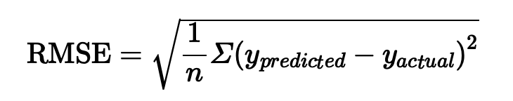
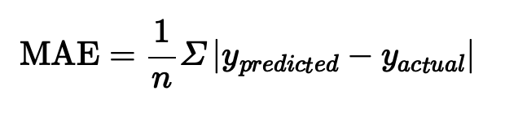
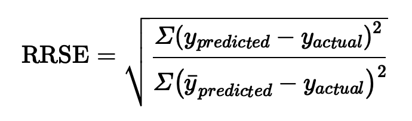
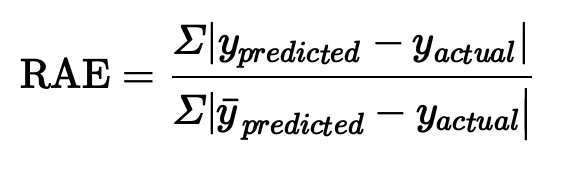
```


---
# Classification

We calculate the *confussion matrix*, in which the model output predicted classes are compared to the actual classes and the count of the model output in the cells of the matrix. This informs you of the *true positives*, *true negatives*, *false positives*, *false negatives*. This numbers allow us to get metrics on the model: 

```{r, fig.align='center', echo=F}
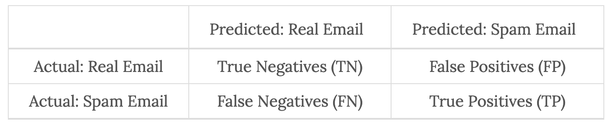
```

- *Sensitivity or recall*: When it is actually the positive result, how often does it predict correctly?

```{r, fig.align='center', echo=F, out.width = "30%"}
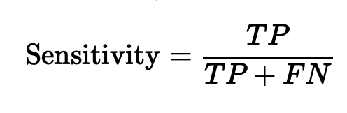
```

---
# Classification

- *Specificity*, When it is actually the negative result, how often does it predict correctly?

```{r, fig.align='center', echo=F, out.width = "30%"}
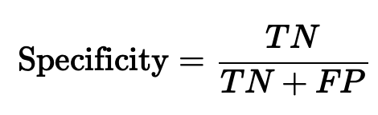
```

- *Precision*: When it predicts the positive result, how often is it correct?

```{r, fig.align='center', echo=F, out.width = "30%"}
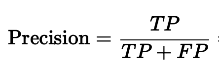
```

- *Accuracy*: How often is the classifier correct?

```{r, fig.align='center', echo=F, out.width = "30%"}
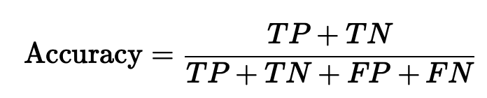
```

- *F1 Score*: Harmonic mean of precision and recall.

```{r, fig.align='center', echo=F, out.width = "30%"}
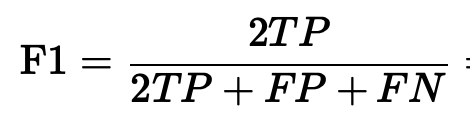
```

---
class: inverse, center, middle

# Cross-validation

---
# Cross-validation

The process of training and testing data is still somewhat limited, however. In one capacity, when you’re testing the model output against the reserved data, you are seeing only what the error is for that exact grouping of the test data.

**Cross-validation** is a statistical technique by which you take your entire dataset, split it into a number of small train/test chunks, evaluate the error for each chunk, and then average those final errors. This approach winds up being a more accurate way of assessing whether your modeling approach has any issues that could be hidden in various combinations of the training and test parts of the dataset.

```{r, fig.align='center', out.width = "40%", echo=F}
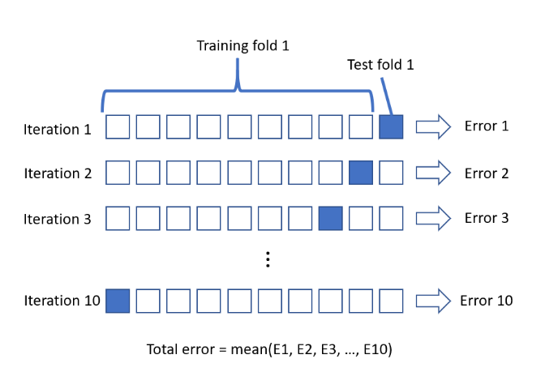
```

---
# k-fold Cross-validation

1. Take your dataset and split it into k chunks.
2. For each of these chunks:
  1. Split the data into a smaller train/test set.
  2. Evaluate that individual chunk’s error. 
3. After you have all the errors for all the chunks, take the average.

---
class: inverse, center, middle

# Overfitting and underfitting

---
# Overfitting

Before we can prevent overfitting, we need to give the term a rigorous meaning. A predictive model is close to the truth when its predictions about future (test) data are accurate.

- **Overfitting**: When we see the predictions for the model start to get worse on the test data. That’s because the model is becoming too complex and noisy, and it fits quirks in the training data that aren’t present in the test data.
- When a model isn’t complex enough to fit even the training data, we call that **underfitting**.

--

There is a term called model **capacity** or **complexity**. Model capacity/complexity refers to the level of variation that the model can work with. The higher the capacity the more variation the model can cope with. For example, if I have a polynomial model, the linear model with error *E* is less complex than the cuadratic model with less error. The accuracy of the second is better but it is more complex. If I increase the polynomial dregree increases the complexity of the model but the error is smaller.  The model becomes very complex and fits the training data very well but unfortunately, it is a very weak for unseen data. 

---
# Preventing Overfitting

**Regularization** in machine learning is the process of regularizing the parameters that constrain, regularizes, or shrinks the coefficient estimates towards zero. Note: this method is used for regression problems, cross-validation and feature ingeniering are methods you can apply to every problem.

Let's consider the graph bellow:

```{r overfitting, echo=F, fig.align='center', out.width = "30%"}
knitr::include_graphics('https://chunml.github.io/images/tutorials/regularization/reg_graph.png')
knitr::include_graphics('http://res.cloudinary.com/dyd911kmh/image/upload/f_auto,q_auto:best/v1533936356/Screen_Shot_2018-08-10_at_5.25.26_PM_ltnepj.png')
knitr::include_graphics('http://res.cloudinary.com/dyd911kmh/image/upload/f_auto,q_auto:best/v1533936356/Screen_Shot_2018-08-10_at_5.25.32_PM_qmt5zt.png')
```

---
# Preventing Overfitting

- Imagine you got some noises in our training dataset, where the data’s magnitude is far different than the others, those noises will cause our model to put more weight into the coefficient of higher degree, leading to overfitting.

- Imagine you are facing a problem where you are provided with a large dataset, and each of them contains many features. You don’t know which features to drop, and even worse if it turns out that every feature is fairly informative, which means that dropping some features will likely ruin the algorithm’s performance.

**Through the use of regularization, you can make your model more succinct and reduce the noise in the dataset that might be coming from features that have little impact on what you are trying to model against.**


---
class: inverse, center, middle

# The Bias-Variance Tradeoff

---
# Bias and variance

Imagine that the center of the target is a model that perfectly predicts the correct values. Each hit represents an individual realization of our model, given the chance variability in the training data we gather. Sometimes we will get a good distribution of training data so we predict very well while sometimes our training data might be full of outliers or non-standard values resulting in poorer predictions. 

```{r biasvar, echo=F, fig.align='center', out.width = "50%"}
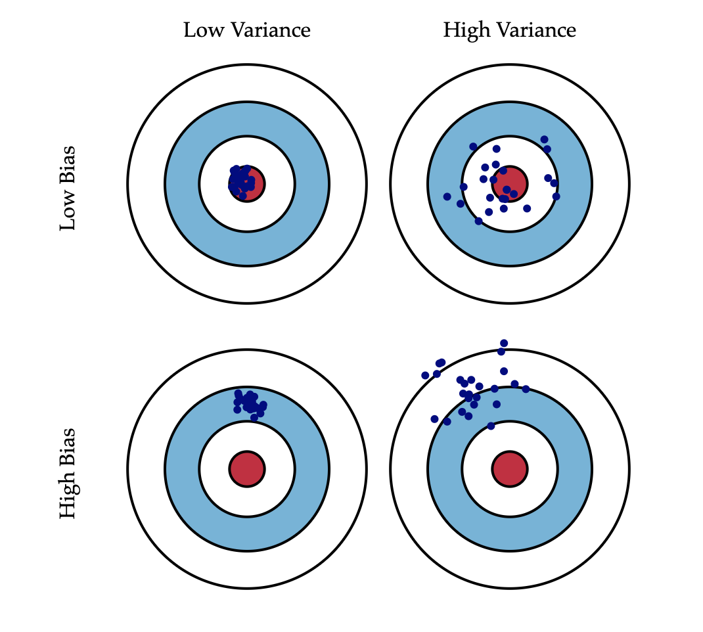
```

---
# The error function

If we are trying to predict *Y* given parameters *X*, we try to find *f* so that in *Y = f(X) + E* the error is almost 0. We may then estimate a model *g(X)* of *f* with an error function.

In case of a linear model:

```{r error, echo=F, fig.align='center', out.width = "30%"}
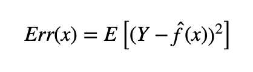
```
```{r, echo=F, fig.align='center', out.width = "40%"}
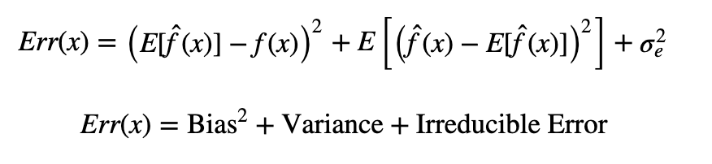
```

In case of a classification problem with a knn model:

```{r, echo=F, fig.align='center', out.width = "40%"}
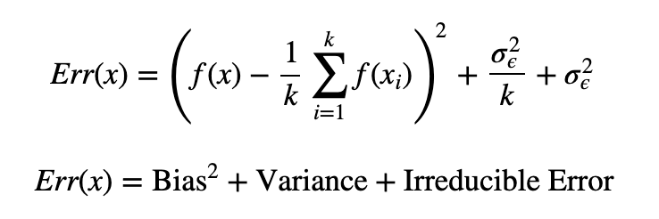
```

That third term, irreducible error, is the noise term. We want to be able to reduce both the bias and variance terms to 0. However there is a tradeoff between minimizing the bias and minimizing the variance.

---

In superviser learning:

- **Underfitting** happens when a model unable to capture the underlying pattern of the data. These models usually have high bias and low variance. 

- **Overfitting** happens when our model captures the noise along with the underlying pattern in data. It happens when we train our model a lot over noisy dataset. These models have low bias and high variance. 