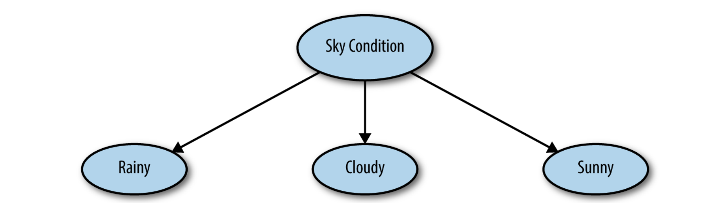
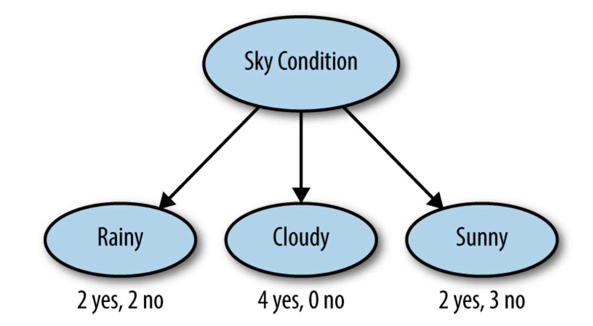

class: inverse, center, middle

# Tree-Based Methods

```{r setup, include=FALSE}
options(htmltools.dir.version = FALSE, eval = FALSE, message = FALSE,
       fig.retina = 3)
```

---
# Decision trees

Decision tree is a type of supervised learning algorithm that can be used in both regression and classification problems. Tree-based models can be a lot  intuitive.

```{r, fig.align='center', echo=F, out.width = "45%"}
knitr::include_graphics('http://res.cloudinary.com/dyd911kmh/image/upload/f_auto,q_auto:best/v1528907338/decision-tree_c2yyos.png')
```

- **Root Node** represents the entire population or sample.
- **Splitting** is a process of dividing a node into two or more sub-nodes.
- When a sub-node splits into further sub-nodes, it is called a **Decision Node.**
- Nodes that do not split is called a **Terminal Node** or a **Leaf**.
- When you remove sub-nodes of a decision node, this process is called **Pruning**.
- A sub-section of an entire tree is called **Branch**.
- A node, which is divided into sub-nodes is called a **parent** node of the sub-nodes; whereas the sub-nodes are called the **child** of the parent node.

---
# Decision trees

```{r, echo=F}
weather <- tibble::tribble(
    ~Week, ~Sky_condition, ~Wind_speed, ~Humidity, ~Good_result,
        1,       "cloudy",       "low",    "high",        "yes",
        2,        "rainy",       "low",  "normal",        "yes",
        3,        "sunny",      "high",  "normal",        "yes",
        4,       "cloudy",      "high",    "high",        "yes",
        5,       "cloudy",       "low",  "normal",        "yes",
        6,        "rainy",      "high",    "high",         "no",
        7,        "rainy",      "high",  "normal",         "no",
        8,       "cloudy",      "high",  "normal",        "yes",
        9,        "sunny",       "low",    "high",         "no",
       10,        "sunny",       "low",  "normal",        "yes",
       11,        "rainy",       "low",  "normal",        "yes",
       12,        "sunny",       "low",    "high",         "no",
       13,        "sunny",      "high",    "high",         "no"
    )
head(weather)
```

The tree subsets the data by certain criteria and then builds a tree so that when we have new data, it follows the branches of the tree to a result.

```{r, fig.align='center', echo=F, out.width = "60%"}

```

---
# Splitting the trees

You begin by looking at how a decision tree works by splitting on the variable *Sky Condition*, but why did we choose that one? Why not choose a different variable to split on instead? A decision tree wants to maximize the *purity* of its splits.

```{r, fig.align='center', echo=F, out.width = "60%"}

```

---
# Pros and cons

The major advantage of using decision trees is that they are intuitively very easy to explain. They closely mirror human decision-making compared to other regression and classification approaches. They can be displayed graphically, and they can easily handle qualitative predictors without the need to create dummy variables.

However, decision trees generally do not have the same level of predictive accuracy as other approaches, since they aren't quite robust. A small change in the data can cause a large change in the final estimated tree.

By aggregating many decision trees, using methods like bagging, random forests, and boosting, the predictive performance of decision trees can be substantially improved.


