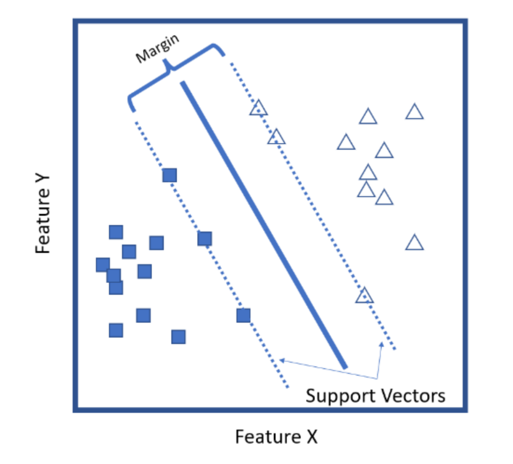

class: inverse, center, middle

# Support Vector Machines

```{r setup, include=FALSE}
options(htmltools.dir.version = FALSE, eval = FALSE, message = FALSE,
       fig.retina = 3)
```

---
# Support Vector Machines

Support vector machines, known better as SVMs, are a machine learning model that use hyperplanes to separate data. To separate and partition our data, we find some kind of plane (or in the cases of two-dimensional data, a line) that separates them and use the vectors that maximize the separation in the data.

```{r, fig.align='center', echo=F, out.width = "50%"}

```

---
# Support Vector Machines

SVMs work by employing something called the *kernel trick*: This is a method by which we can **transform** the data for which we are trying to draw a decision boundary, and then **apply a hyperplane** separation on that transformed data. In its simplest form, the kernel trick means transforming data into another dimension that has a clear dividing margin between classes of data.

In practice, this transformation is more or less a **black box** because the feature space can be quite complex, but the idea is still the same.

```{r, fig.align='center', echo=F, out.width = "60%"}
knitr::include_graphics('https://upload.wikimedia.org/wikipedia/commons/thumb/c/cc/Kernel_trick_idea.svg/1000px-Kernel_trick_idea.svg.png')
```

---
# Iris - Support Vector Machines

```{r data_iris, message=F, warning = F, fig.align='center', fig.height=4, fig.width=11}
library(e1071)

iris_2dimension <- iris[, c("Petal.Length", "Petal.Width", "Species")]
index <- caret::createDataPartition(iris_2dimension$Species, p = 0.3, list = F)
train <- iris_2dimension[index, ]
test <- iris_2dimension[-index, ]

svmfit <- e1071::svm(Species ~ ., data = train, kernel = "linear", scale = T)

plot(svmfit, train)
```

---
# Iris - Support Vector Machines

```{r data_ungrouped, message=F}
tuned <- tune(svm, Species ~ ., data = train, kernel = "linear",
              ranges = list(cost = 10^(-3:3)))

summary(tuned)
```

---
# Iris - Support Vector Machines

```{r, message=F, warning = F, fig.align='center', fig.height=5, fig.width=11} 
svmfit <- svm(Species ~ ., data = train, kernel = "linear",
              cost = 0.1, scale = T)

plot(svmfit, train)
```

---
class: inverse, center, middle

# k-Nearest Neighors

---
# kNN

k-nearest neighbors (kNN) is a rather simple machine learning algorithm that basically takes all the available cases in our data and predicts a target based on some kind of similarity measure—in this case, distance. We supose our neighbors to be like us, so the distance gives us a prediction.

For a regression example, the kNN algorithm calculates the average of our response variable for the kNNs. The mathematical underpinnings are the same for classification, but tweaked slightly because those are categorical instead of numeric values.

The algorithm is highly unbiased in nature and makes no prior assumption of the underlying data. Being simple and effective in nature, it is easy to implement and has gained good popularity. Indeed it is simple but kNN algorithm has drawn a lot of flake for being extremely simple! If we take a deeper look, this doesn’t create a model since there’s no abstraction process involved. Yes, the training process is really fast as the data is stored verbatim (hence lazy learner) but the prediction time is pretty high with useful insights missing at times. Therefore, building this algorithm requires time to be invested in data preparation (especially treating the missing data and categorical features) to obtain a robust model.

---
# Iris with kNN

```{r knn, message=F}
library(caret)

nor <-function(x) { (x -min(x))/(max(x)-min(x)) }

index <- createDataPartition(iris$Species, p = 0.7, list=F)

train <- iris[index, ]
test <- iris[-index, ]

prop.table(table(train$Species)) * 100
prop.table(table(iris$Species)) * 100
```

---
# Iris with kNN

```{r preproc, message=F}
trainX <- train[, c(1,2,3,4)]
preProcValues <- preProcess(x = trainX, method = c("center", "scale"))
preProcValues
knn <- train(Species ~ ., data = train, method = "knn", 
             preProcess = c("center","scale"), tuneLength = 20)
```

--

```{r train, message=F, echo = F, fig.align='center', fig.height=3, fig.width=11}
plot(knn)
```

---
# Iris with kNN

```{r predict, message=F}
knn_p <- predict(knn, newdata = test)
confusionMatrix(knn_p, test$Species)
```